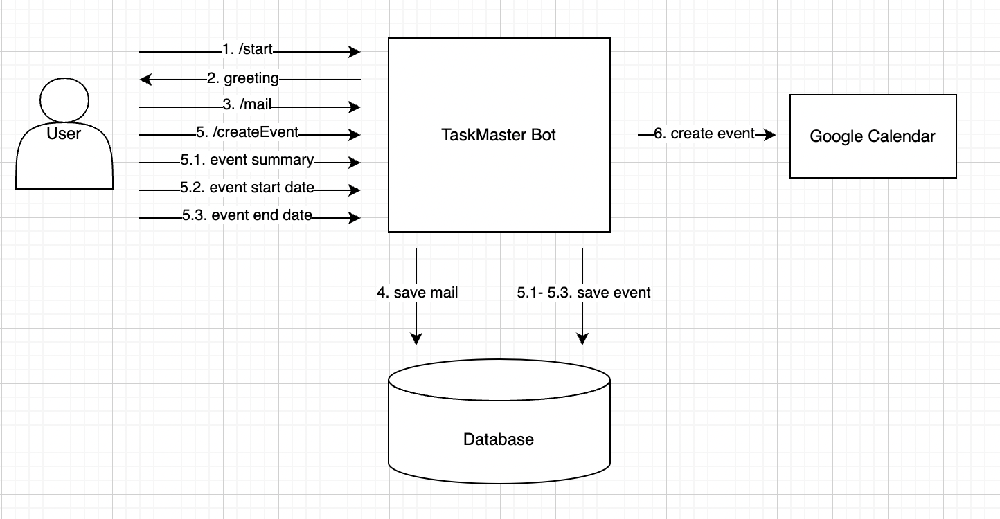

# TaskMaster

### Использование
Воспользоваться ботом можно по [ссылке](t.me/itmo_taskmaster_bot)

### Описание приложения и его работы
Цель проекта заключается в разработке Telegram бота, действующего как личный ассистент для автоматизации процесса планирования встреч. 
Этот инструмент позволит пользователям эффективно организовывать события в Zoom через общение с ботом в чате.

### Аудитория приложения
- Предприниматели
- Индивидуальные предприниматели
- Менеджеры среднего и высшего звена
- Консультанты
- Фрилансеры

### Логика работы
